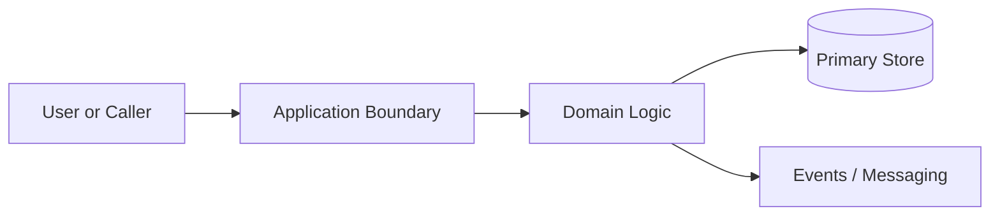
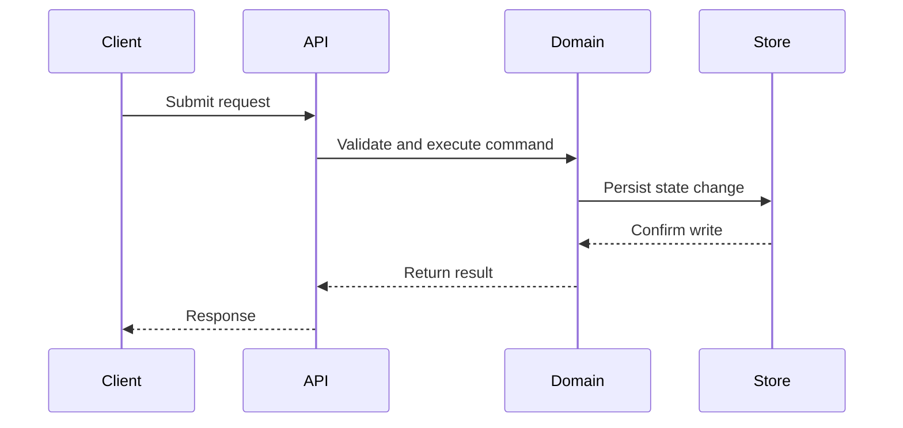

# [Feature Name] Architecture Document

**Status:** Draft
**Source PRD:** `docs/specs/<module>/<submodule>/<spec>.md`
**Audience:** Architects, Senior Developers
**Date:** [YYYY-MM-DD]

## Overview

Summarize the system intent, affected boundaries, and architectural scope.

## Architecture Diagram

Show the main components, boundaries, and integrations.

Prefer Mermaid when it makes the structure easier to understand.

Add a short explanation below the diagram.

## Data Flow

Explain how data moves through the system.

Use a sequence diagram, flowchart, or stepwise table when it helps.

## Key Design Decisions

List the major architectural decisions with rationale and trade-offs.

Prefer a table with columns such as:

- Decision
- Why
- Trade-off
- Alternative considered

## Technology Stack

Describe only the technologies relevant to this design:

- language or runtime
- frameworks or libraries
- storage
- messaging
- deployment or runtime environment
- observability tooling

## Scalability

Describe expected load shape and scaling pressure points:

- horizontal or vertical scaling characteristics
- stateless vs stateful concerns
- storage growth
- concurrency considerations
- background processing or queueing
- failure isolation

## Security

Describe architecture-level security posture:

- trust boundaries
- privileged components
- network exposure
- data protection approach
- security-sensitive dependencies
- risks and mitigations

## Monitoring and Observability

Describe how the architecture will be observed in production:

- dashboards or signals to monitor
- logs, traces, and alerts
- SLO-adjacent thinking when relevant
- operational blind spots

## Metrics

Define the key metrics for this design.

Prefer a table with:

- Metric
- Why it matters
- Source
- Alert or threshold guidance, only when grounded in repo or PRD context

## References

Link to the source PRD and any other artifacts that shaped the design.
